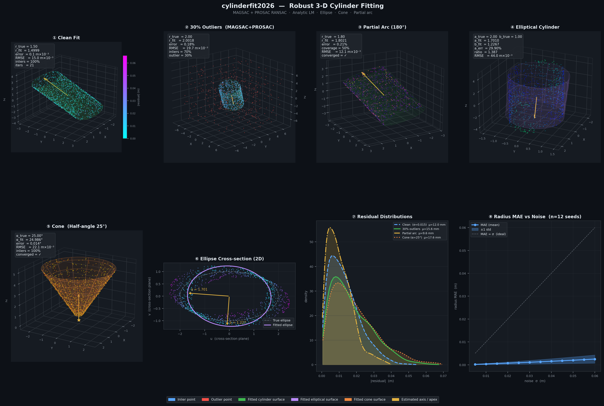

# cylinderfit2026

**Fast, robust 3-D cylinder fitting for Python.**

[](https://github.com/weiykong/cylinderfit2026/actions/workflows/ci.yml)
[](https://codecov.io/gh/weiykong/cylinderfit2026)
[](https://pypi.org/project/cylinderfit2026/)
[](https://pypi.org/project/cylinderfit2026/)
[](LICENSE)

---



*Eight fitting scenarios — clean cylinder, 30% outliers, 180° partial arc, elliptical cross-section, cone, 2-D ellipse projection, residual distributions, and radius MAE vs noise.*

---

## Highlights

| Feature | Detail |
|---------|--------|
| **Estimation** | MAGSAC soft scoring + PROSAC quality-ranked sampling |
| **Refinement** | Levenberg–Marquardt with analytic closed-form Jacobian |
| **Parallelism** | Multi-threaded RANSAC via `ThreadPoolExecutor` (`n_jobs`) |
| **Shapes** | Circular cylinder · Elliptical cylinder · Cone · Curved cylinder · Pipe network |
| **I/O** | PLY · PCD · LAS/LAZ · XYZ · CSV · Open3D adapter |
| **Testing** | 168 tests — property-based (Hypothesis), golden-value regression, statistical bias, cross-implementation |
| **CI** | Ubuntu · macOS · Windows × Python 3.9 – 3.12 |
| **Coverage** | ≥ 80 % branch coverage enforced |

---

## Install

```bash
pip install cylinderfit2026
```

With optional extras:

```bash
pip install "cylinderfit2026[visualize]"   # matplotlib plots
pip install "cylinderfit2026[io]"           # LAS/LAZ support (laspy)
pip install "cylinderfit2026[dev]"          # pytest + hypothesis + pytest-cov
```

---

## Quick start

```python
import numpy as np
from cylinderfit2026 import fit_cylinder, generate_noisy_cylinder

# Generate synthetic data (or load your own N×3 array)
syn = generate_noisy_cylinder(radius=1.5, noise=0.02, outlier_fraction=0.25, random_state=42)

model = fit_cylinder(syn.points, threshold=0.06, ransac_trials=128, random_state=42)

print(f"radius    : {model.radius:.4f}")
print(f"axis      : {model.axis_direction}")
print(f"RMSE      : {model.rmse:.4f}")
print(f"inliers   : {model.inlier_mask.mean():.0%}")
print(f"converged : {model.converged}")
```

### Load a real point cloud

```python
from cylinderfit2026 import load_points, fit_cylinder

pts = load_points("scan.ply")          # PLY, PCD, LAS, XYZ, CSV
model = fit_cylinder(pts, threshold=0.05)
print(model.to_json())
```

---

## API overview

### Fitting functions

```python
from cylinderfit2026 import (
    fit_cylinder,               # general robust fitter
    fit_cylinder_known_radius,  # radius pinned
    fit_cylinder_with_normals,  # normal-seeded axis init
    fit_cylinder_fixed_axis,    # axis fixed
    fit_cylinder_constrained_axis,  # axis within a cone
)
from cylinderfit2026.elliptical import fit_elliptical_cylinder
from cylinderfit2026.cone       import fit_cone
from cylinderfit2026.curved     import fit_curved_cylinder
from cylinderfit2026.network    import find_cylinder_joints, build_pipe_network
```

### Key parameters (`fit_cylinder`)

| Parameter | Default | Description |
|-----------|---------|-------------|
| `threshold` | auto | Inlier distance (same units as points). Auto-estimated when omitted. |
| `ransac_trials` | 128 | RANSAC iterations. More → more robust, slower. |
| `n_jobs` | 1 | Worker threads for parallel RANSAC. |
| `random_state` | None | Integer seed for full reproducibility. |
| `known_radius` | None | Fix radius and solve only for axis + position. |
| `initial_axis` | None | Warm-start axis direction to skip RANSAC. |

### `CylinderModel` attributes

```python
model.axis_point       # np.ndarray (3,) — point on axis near cloud centroid
model.axis_direction   # np.ndarray (3,) — unit vector
model.radius           # float
model.height           # float  (height_max − height_min)
model.inlier_mask      # np.ndarray (N,) bool
model.residuals        # np.ndarray (N,) signed radial distances
model.rmse             # float  — inlier RMSE
model.converged        # bool
model.iterations       # int
model.start_point      # np.ndarray (3,)
model.end_point        # np.ndarray (3,)
model.to_dict()        # → dict
model.to_json()        # → str
```

---

## Fitting scenarios

### Robust fit with outliers

```python
model = fit_cylinder(pts, threshold=0.08, ransac_trials=256, random_state=0)
# MAGSAC scoring down-weights outliers; PROSAC prefers near-surface samples
```

### Known radius (e.g. standard pipe)

```python
model = fit_cylinder_known_radius(pts, radius=0.0508)   # 2-inch nominal
print(model.radius)   # exactly 0.0508
```

### Elliptical cross-section

```python
from cylinderfit2026.elliptical import fit_elliptical_cylinder

model = fit_elliptical_cylinder(pts, threshold=0.05)
print(model.semi_major, model.semi_minor, model.aspect_ratio)
```

### Cone

```python
from cylinderfit2026.cone import fit_cone

model = fit_cone(pts, ransac_trials=64, random_state=0)
print(f"half-angle: {model.half_angle_deg:.2f}°")
print(f"apex: {model.apex}")
```

### Curved cylinder (bent pipe)

```python
from cylinderfit2026.curved import fit_curved_cylinder

model = fit_curved_cylinder(pts, n_segments=10)
print(f"spine length: {model.total_length:.3f}")
print(f"mean curvature: {model.curvature_mean:.4f}")
```

### Pipe network junction detection

```python
from cylinderfit2026.network import find_cylinder_joints

cylinders = [fit_cylinder(seg) for seg in segments]
joints = find_cylinder_joints(cylinders, threshold=0.05)
for j in joints:
    print(f"cylinders {j.cylinder_a_idx}↔{j.cylinder_b_idx}  "
          f"gap={j.gap:.3f}  angle={j.angle_deg:.1f}°")
```

---

## Residuals and inlier contract

The inlier mask always satisfies:

```
inlier_mask[i]  ⟺  |residuals[i]| ≤ threshold
```

Residuals are signed radial distances: positive = outside, negative = inside the cylinder surface.

---

## Reproducibility

```python
m1 = fit_cylinder(pts, random_state=42)
m2 = fit_cylinder(pts, random_state=42)
assert (m1.axis_direction == m2.axis_direction).all()   # bit-identical
```

---

## File I/O

```python
from cylinderfit2026 import load_points

pts = load_points("scan.ply")      # ASCII or binary PLY
pts = load_points("scan.pcd")      # PCL PCD (ASCII or binary)
pts = load_points("scan.las")      # LAS / LAZ (requires laspy extra)
pts = load_points("scan.xyz")      # whitespace or comma-delimited
pts = load_points("scan.csv")      # auto-detects comma delimiter
```

### Open3D adapter

```python
import open3d as o3d
from cylinderfit2026 import from_open3d

cloud = o3d.io.read_point_cloud("scan.ply")
pts = from_open3d(cloud)
model = fit_cylinder(pts)
```

---

## Algorithm

```
Input: N×3 point cloud
  │
  ├─ PROSAC RANSAC (quality-ranked sampling)
  │    └─ MAGSAC scoring (Gaussian soft inlier count)
  │         └─ PCA fallback on < 8 candidates
  │
  ├─ Levenberg–Marquardt refinement
  │    ├─ Analytic closed-form Jacobian  ∂r/∂(p₀, d̂, R)
  │    └─ Huber-weighted iterative reweighting
  │
  └─ CylinderModel (axis_point, axis_direction, radius, residuals, …)
```

**MAGSAC scoring** replaces hard inlier counts with a Gaussian soft count
`Σ exp(−rᵢ²/2σ²)` where `σ = threshold/3`. This produces a smoother
landscape for the best-hypothesis selection and is more robust at the
inlier/outlier boundary.

**PROSAC** ranks candidate points by their proximity to the current best
hypothesis and biases early trials toward high-quality points, reducing
the number of trials needed to find a good seed.

**Analytic Jacobian** — for a cylinder with axis point p₀ and unit direction d̂,
the residual for point pᵢ is `rᵢ = ‖qᵢ‖ − R` where `qᵢ = (pᵢ − p₀) − [(pᵢ − p₀)·d̂]d̂`.
The 6-column Jacobian has a closed form that avoids finite-difference overhead
and is more numerically stable near the axis.

---

## Testing

```bash
# Fast smoke test
python -m pytest tests/ -q

# With coverage report
python -m pytest tests/ --cov=cylinderfit2026 --cov-report=html

# Property-based tests only
python -m pytest tests/test_properties.py -v

# Golden-value regression pins
python -m pytest tests/test_regression.py -v
```

The test suite includes:
- **Unit tests** (`test_core.py`, `test_shapes.py`, `test_io.py`) — API contract
- **Property tests** (`test_properties.py`) — Hypothesis-driven geometric invariants
- **Regression tests** (`test_regression.py`) — golden-value pins for radius/RMSE/inliers
- **Bias tests** (`test_bias.py`) — estimator unbiasedness and consistency over 20 seeds
- **Edge case tests** (`test_edge_cases.py`) — NaN/Inf, partial arc, degenerate geometry
- **Cross-implementation** (`test_cross_impl.py`) — comparison vs `pyransac3d` / `cylinder_fitting` when installed

---

## Benchmark

```bash
pip install "cylinderfit2026[competitors]"
python examples/run_benchmark.py
```

Generates `examples/benchmark_report.md` comparing cylinderfit2026 against
`pyransac3d` and `cylinder_fitting` across clean, noisy, partial-arc, and
short-wide cylinder scenarios.

---

## Contributing

See [CONTRIBUTING.md](CONTRIBUTING.md). In short:

```bash
git clone https://github.com/weiykong/cylinderfit2026
pip install -e ".[dev]"
python -m pytest tests/ -q
ruff check src/ tests/
```

PRs are welcome. Please update `CHANGELOG.md` and (if algorithm behaviour changed) the golden pins in `tests/test_regression.py`.

---

## License

[MIT](LICENSE) © 2026 CylinderFit 2026 Contributors
